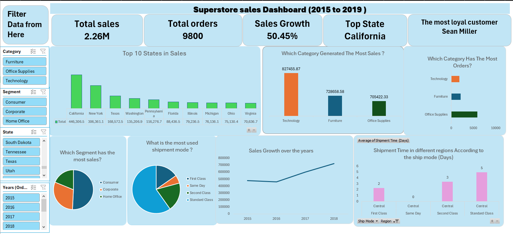

# 📊 Superstore Sales Analysis (2015-2018)

## 🎯 Project Overview
Comprehensive analysis of Superstore sales data to identify trends, customer behavior, shipment efficiency, and growth opportunities.

**Tools Used:** Microsoft Excel (Pivot Tables, Power Pivot, Power Query, Dynamic Charts, Data Cleaning)

## 📁 Project Structure

## 🛠️ Technical Skills Demonstrated
- **Data Cleaning:** Power Query, handling missing values, standardization
- **Data Modeling:** Power Pivot relationships and DAX calculations
- **Analysis:** Pivot Tables, calculated fields, trend analysis
- **Visualization:** Interactive dashboards, dynamic charts, slicers
- **Business Insight:** ROI analysis, customer segmentation, performance metrics

---

## 🔍 Sales Analysis Project – Superstore (2015–2018)

### 📌 Objective
To analyze Superstore sales data from 2015 to 2018 in order to identify trends, customer behavior, shipment efficiency, and opportunities for business growth.

### 🧹 Data Preparation & Cleaning
- Imported and transformed raw data using Excel Power Pivot and Power Query Editor
- Created a structured dynamic table to organize and manage data efficiently
- Detected and handled missing values and duplicates using filter and sort functions
- Standardized date formats using Split Column and Merge techniques
- Corrected typos and inconsistent spellings in categorical fields (e.g., State, Category, Segment)
- Added calculated columns such as Shipment Time to enhance shipping performance analysis

### ❓ Business Questions Addressed
- Which state, city, and region generated the most sales?
- Is there a relationship between shipment time and location?
- Which shipment mode was used most frequently?
- Which category had the highest quantity sold?
- Which customer segment generated the most revenue?
- What year saw the highest overall sales?

### 📊 Data Analysis
- Used Pivot Tables and Pivot Charts to answer each business question
- Created 7 interactive visualizations, connected with dynamic filters for Category, Segment, State, and Year
- Designed a clean, insightful Excel Dashboard to present findings visually and interactively

 ### 📊📉 Dashboard 

 

### 📈 Key Insights
1. **🏆 California and New York** are the top-performing states in sales, with strong representation across all four regions.
2. **📦 Office Supplies** had the highest number of orders but the lowest revenue, unlike **Technology**, which generated the highest revenue from fewer orders.
3. **👥 The Consumer segment** dominated total sales, while Corporate and Home Office accounted for less than half combined — suggesting an opportunity to grow B2B sales with targeted offers.
4. **🚚 Standard Class** is the most commonly used shipment mode. Consider promoting other modes (e.g., First Class, Same Day) with incentives or bundled shipping benefits.
5. **📊 Sales increased steadily** from 2015 to 2018, indicating strong business growth and positive market momentum.

### ✅ Recommendations
- Invest in marketing strategies focused on the Corporate and Home Office segments
- Promote premium shipping options to balance logistics load and customer satisfaction
- Continue leveraging Technology product sales, as they deliver higher revenue per order
- Monitor and optimize regions with longer shipment times to improve delivery efficiency

---

## 📞 Contact
For questions or collaboration opportunities, feel free to connect with me on [LinkedIn](https://www.linkedin.com/in/youssef-gebreal-297a43338/)
